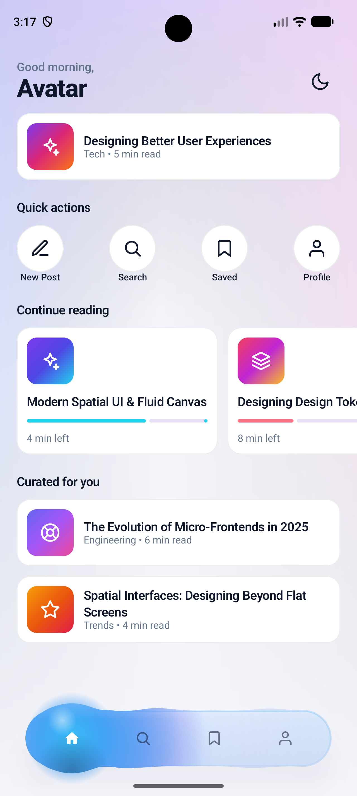
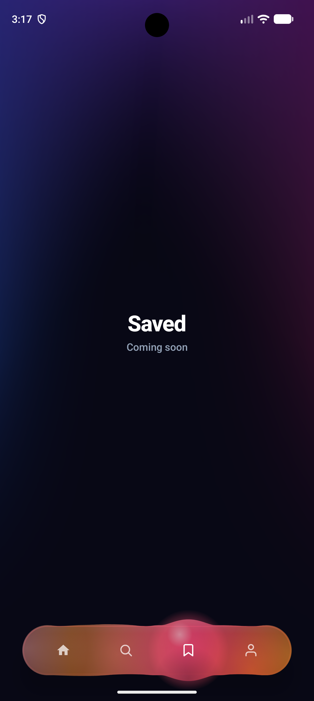
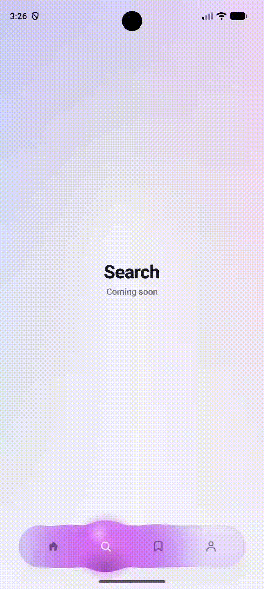
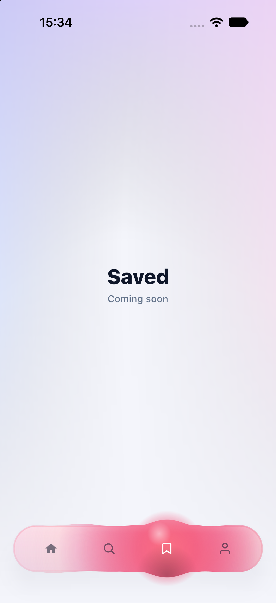
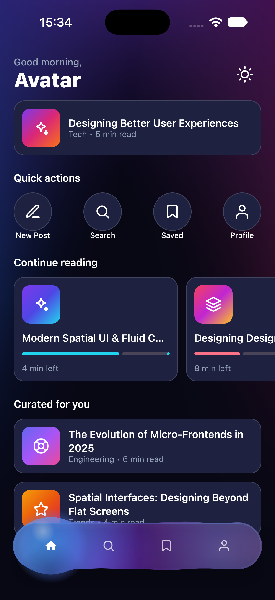

# FluidBottomBar

**FluidBottomBar** is a Compose Multiplatform bottom navigation bar for Android and iOS, where the
selection indicator behaves like liquid — it flows between tabs, stretches with momentum, and
spreads each tab's color across the bar.

## Features

- 💧 **Liquid Selection Indicator** – A fluid blob glides between tabs with spring physics,
  stretching and wobbling as it moves before settling into place.
- 🎨 **Per-Tab Color Palettes** – Each tab carries its own gradient palette that spreads across the
  bar and blends smoothly from the previous selection.
- 👆 **Drag to Select** – Press and drag the indicator across the bar; it follows your finger and
  snaps to the nearest tab on release.
- 🌗 **Light & Dark Themes** – Ships with polished defaults for both modes, following the system
  theme automatically.
- 📱 **Kotlin Multiplatform** – A single implementation rendered natively on Android and iOS with
  Compose Multiplatform.
- ♿ **Accessible by Default** – Tabs expose selection state, tab roles and labels to screen
  readers.

## Demo

<div style="display: flex; gap: 32px; flex-wrap: wrap; justify-content: center;">

  <!-- Android column -->
  <div style="text-align: center;">
    <strong>Android UI</strong><br/>
    
    
    
  </div>

  <!-- iOS column -->
  <div style="text-align: center;">
    <strong>iOS UI</strong><br/>
    
    
  </div>

</div>

## Platforms

| Platform | Targets                         |
|----------|---------------------------------|
| Android  | API 24+                         |
| iOS      | `iosArm64`, `iosSimulatorArm64` |

## Implementation

Create a list of `FluidBarItem`s and pass it to `FluidBottomBar` together with the selected index:

```kotlin
@Composable
fun MyBottomBar() {
    var selectedIndex by remember { mutableIntStateOf(0) }

    val items = listOf(
        FluidBarItem(
            icon = painterResource(Res.drawable.ic_home),
            label = "Home",
            palette = FluidPalettes.Aurora,
        ),
        FluidBarItem(
            icon = painterResource(Res.drawable.ic_search),
            label = "Search",
            palette = FluidPalettes.Orchid,
        ),
        FluidBarItem(
            icon = painterResource(Res.drawable.ic_bookmark),
            label = "Saved",
            palette = FluidPalettes.Sunset,
        ),
        FluidBarItem(
            icon = painterResource(Res.drawable.ic_person),
            label = "Profile",
            palette = FluidPalettes.Ember,
        ),
    )

    FluidBottomBar(
        items = items,
        selectedIndex = selectedIndex,
        onItemSelected = { selectedIndex = it },
        modifier = Modifier
            .navigationBarsPadding()
            .padding(horizontal = 20.dp, vertical = 12.dp),
    )
}
```

To force a specific theme or customize the bar surface, pass your own colors:

```kotlin
FluidBottomBar(
    items = items,
    selectedIndex = selectedIndex,
    onItemSelected = { selectedIndex = it },
    colors = FluidBottomBarDefaults.darkColors(
        unselectedIcon = Color.White.copy(alpha = 0.6f),
    ),
)
```

## Configuration Options

### `FluidBottomBar`

| Parameter        | Description                                         | Default                           |
|------------------|-----------------------------------------------------|-----------------------------------|
| `items`          | Tabs displayed in the bar (at least one required)   | —                                 |
| `selectedIndex`  | Index of the currently selected tab                 | —                                 |
| `onItemSelected` | Called with the index of a tapped or dragged-to tab | —                                 |
| `modifier`       | Modifier applied to the bar                         | `Modifier`                        |
| `colors`         | Surface and icon colors of the bar                  | `FluidBottomBarDefaults.colors()` |

### `FluidBarItem`

| Parameter | Description                                           |
|-----------|-------------------------------------------------------|
| `icon`    | Icon painter, tinted automatically based on selection |
| `label`   | Tab label, used as the accessibility description      |
| `palette` | Color palette applied to the indicator when selected  |

### `FluidBottomBarColors`

Created through `FluidBottomBarDefaults.colors()`, `lightColors()` or `darkColors()`.

| Parameter        | Description                                |
|------------------|--------------------------------------------|
| `surfaceTop`     | Top color of the bar's gradient surface    |
| `surfaceBottom`  | Bottom color of the bar's gradient surface |
| `selectedIcon`   | Tint of the selected tab's icon            |
| `unselectedIcon` | Tint of unselected tab icons               |
| `shadow`         | Color of the bar's drop shadow             |

### `FluidPalette`

| Parameter      | Description                                    |
|----------------|------------------------------------------------|
| `fillCore`     | Center color of the liquid fill                |
| `fillMiddle`   | Middle color of the liquid fill                |
| `fillOuter`    | Outer color of the liquid fill                 |
| `fillEdge`     | Edge color of the liquid fill                  |
| `strokeStart`  | Start color of the indicator outline gradient  |
| `strokeMiddle` | Middle color of the indicator outline gradient |
| `strokeEnd`    | End color of the indicator outline gradient    |

### Built-in Palettes

| Palette                | Look                     |
|------------------------|--------------------------|
| `FluidPalettes.Aurora` | Sky blue, indigo, purple |
| `FluidPalettes.Orchid` | Indigo, purple, pink     |
| `FluidPalettes.Sunset` | Rose, pink, orange       |
| `FluidPalettes.Ember`  | Orange, red, amber       |

## License

This project is licensed under the [Apache License 2.0](LICENSE) — see the [LICENSE](LICENSE) file
for details.
